# Tres Cuatro Cinco Steakhouse

Tres Cuatro Cinco Steakhouse is a restaurant based in Bogotá, Colombia. The restaurant specializes in meats, with its main differentiating feature being that all dishes are prepared on a grill that operates 100% with wood fire, which imparts a unique and distinctive flavor.

The purpose of the website is to showcase some of the dishes and the spaces available so that individuals interested in hosting events at the restaurant can learn more about the venue and provide their contact information to be reached.

---

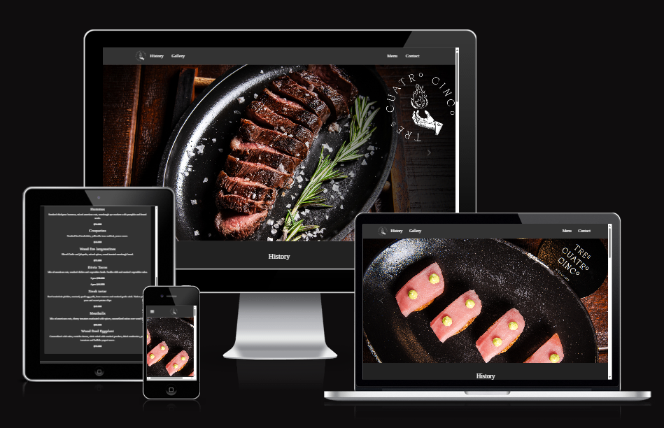

Tres Cuatro Cinco Steakhouse website is live, to access it click [here](https://8000-madlp345-projectportfol-wxb5viruc1k.ws.codeinstitute-ide.net/).

## Table of Contents

1. [User Experience (UX)](#user-experience-ux)
   - [User Stories](#user-stories)
   - [Design](#design)
2. [Features](#features)
3. [Technologies Used](#technologies-used)
4. [Testing](#testing)
5. [Deployment](#deployment)
6. [Credits](#credits)
7. [Acknowledgments](#acknowledgments)

---

## User Experience (UX)

### Site Purpose
To serve as a valuable resource for individuals seeking information about the restaurant, its unique offerings, and its event-hosting capabilities.

### Site Goal
To provide users with essential information about the restaurant, including its menu, ambiance, and unique wood-fire cooking process. Additionally, the website offers a visually appealing gallery of dishes and spaces, along with convenient contact information and a user-friendly form for making reservations or inquiring about hosting events at the venue.

### Audience
The website targets food enthusiasts, event planners, and individuals or groups looking to enjoy premium grilled dishes or host special events in a unique and inviting setting.

#### Current User Goals
- Staying up to date with new menu items or special announcements from the restaurant.

#### New User Goals
- Gain a general understanding of the restaurant’s concept, cooking methods, and atmosphere.
- Explore the menu and view the gallery of dishes and event spaces.
- Contact the restaurant by submitting a form or using the contact details provided on the website.
- Access the restaurant’s social media to stay informed about updates and promotions.

---

## Design

### Color Scheme
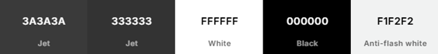

As the pages of the site have a background image, the color scheme was kept minimal to avoid overwhelming users. Black, white, and shades of grey create a classic and modern aesthetic, ensuring readability and contrast.

- **Primary Colors**: #FFFFFF (white) & #000000 (black) for text.
- **Overlay Color**: #333333 for the site's background image overlay.
- **Highlight Color**: #F1F2F2 for subtle highlights and backgrounds.

### Typography
- **Font Family**: Tinos (imported from Google Fonts)

### Imagery
All images on the website were sourced directly from the restaurant.

### Wireframes
Wireframes were created for mobile, tablet and desktop using balsamiq.
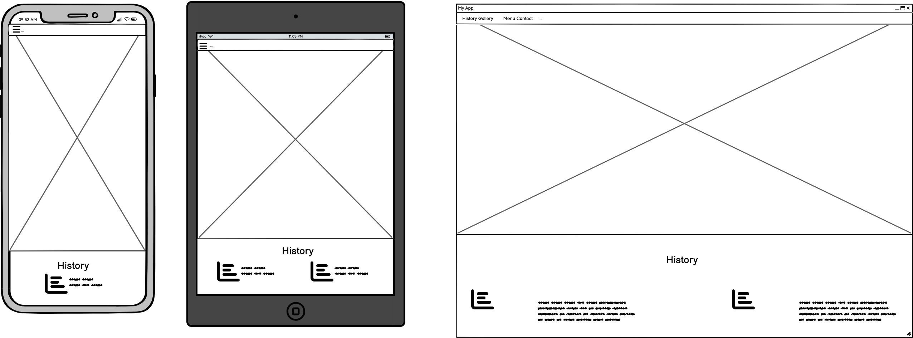
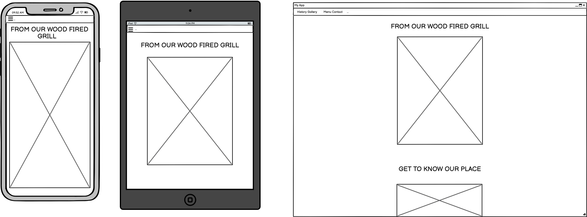
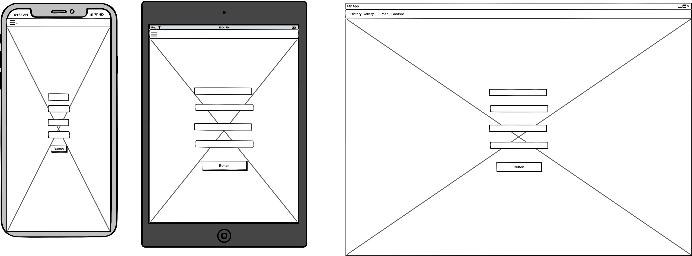
---

## Features

### Existing Features

1. **Navigation Bar**  
     

   -The website features a fixed and consistent navigation bar across all pages, including the landing form page. Users can access the menu at any time, even after submitting the form, allowing them to continue exploring the site. Additionally, the active page is highlighted in the navigation bar, making it easier for visitors to identify their current location and ensure smooth navigation.

    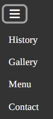  
    -Additionally, I created a simple hamburger menu dropdown for screen widths of 968px or less, acknowledging online forums, and tutorials in the credits section. This enhancement improves the website's accessibility on smaller devices and ensures seamless navigation.  

2. **Home Page**
   - The homepage serves as an engaging introduction to the restaurant's offerings. It features a visually appealing layout with high-quality images of signature dishes, creating an inviting atmosphere for visitors.
   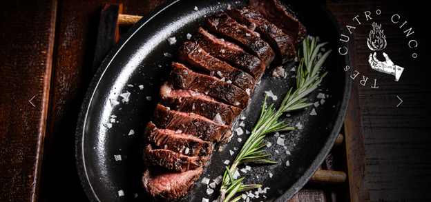
   - **History Section**:
   - Upon scrolling, you will encounter the history section that provides a narrative about the origins and evolution of Tres Cuatro Cinco Steakhouse. Accompanied by evocative images, it offers visitors insight into the restaurant's background and culinary philosophy.
     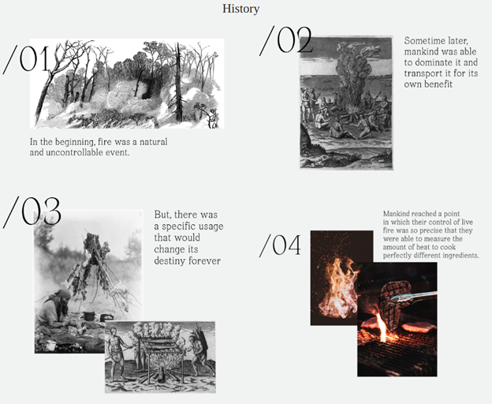
   - **Menu Section**: Organized into categories:
     - Appetizers
     - Mains
     - Salads
     - Sides
     - Desserts
     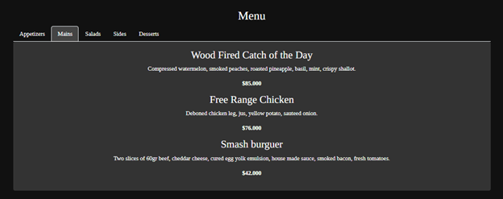
   - **Map Section**: Displays restaurant location.
    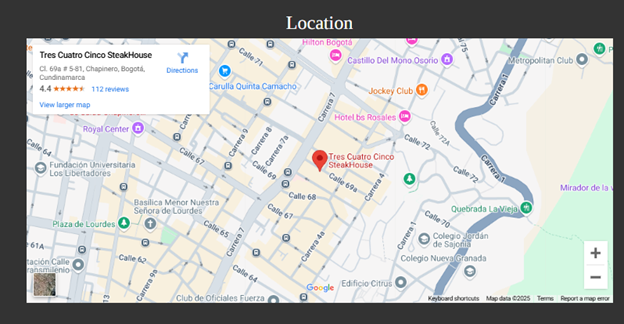
   - **Social Media Links**: Directs users to restaurant’s profiles.
    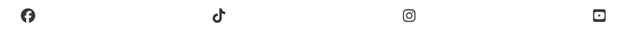
   - **Footer**: Shows the logo, number of contact and directs to the contact page.
    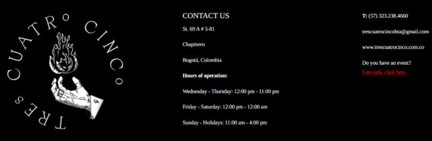
3. **Gallery Page**
   - The purpose of this page is to showcase the food, place and drinks that the restaurant offers. It provides a three different photos carousel of these three segments. Given the extensive number of photos provided by the restaurant, it was better to use these carousels with bootstraps.
    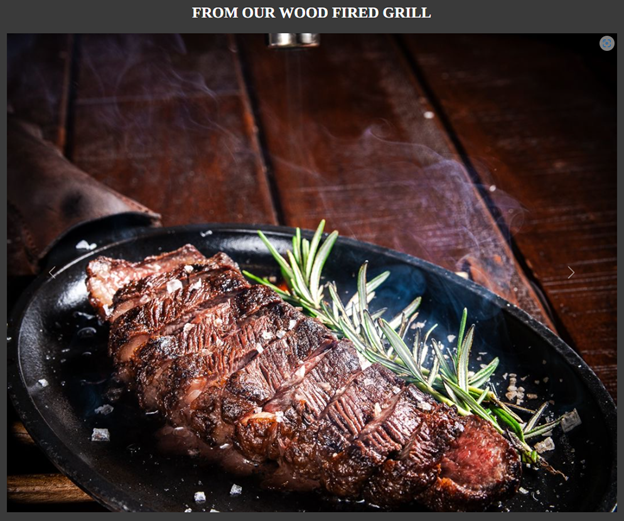
4. **Contact Form**
   - Allows users to provide:
     - First Name
     - Last Name
     - Email
     - Phone Number
     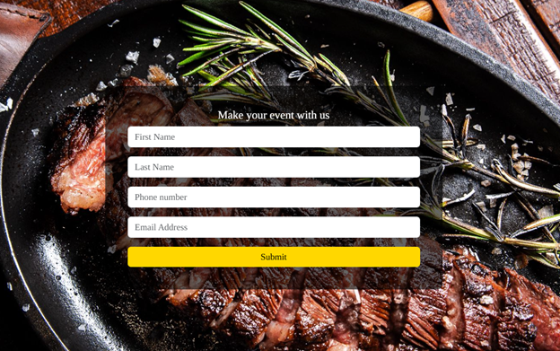
   - **Form Sent Page**: Confirmation message after submission.
      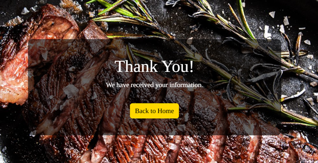
### Future Features
This project represents a prototype website for the restaurant that wants to improve its actual website in the next few months. As a result, there are some specifics that are planned to be implemented soon:
 -Multilingual support
 -Online reservation system
 -Customer reviews and ratings
 -Blog section
 -Dark mode toggle

---

## Testing

### Challenges & Solutions
- Used **Flexbox** for structuring elements and ensuring responsive design.
- Implemented **Bootstrap carousel** to display multiple images dynamically.
- Created a **responsive hamburger menu** using Bootstrap components.
- Optimized **form layout** using structured `
` containers and `max-width` properties.

### Validator Testing
- **HTML Validator**: Issue with `.fa-rotate-by` class (not used in project but flagged by validator).
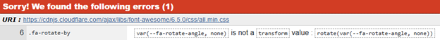
- **CSS Validator**: Passed all checks.
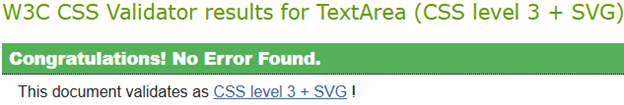
- **Lighthouse Accessibility Score**: •	Page has an excellent Accessibility rating in Lighthouse. 
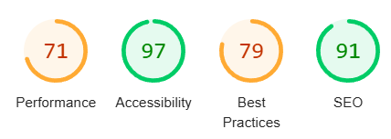
- **Cross-Browser Testing**: Works in Chrome, Safari, and Mozilla.
- **No broken links** found.

## Manual Testing

The following table outlines the manual testing performed for the portfolio website:

| Test Case | Steps to Reproduce | Expected Result | Actual Result | Status (Pass/Fail) |
|-----------|-------------------|----------------|--------------|----------------|
| **Navigation Links** | Click on each menu link (Home, Projects, About, Contact) | Redirects to the correct section/page |  Works correctly | Pass |
| **Mobile Responsiveness** | Open the site on a mobile device or use browser DevTools (`Ctrl + Shift + I`) | Layout adapts properly, no overlapping elements |  Responsive on mobile | Pass |
| **Project Links** | Click on each project thumbnail/link | Opens the correct project details or external link |  Links work correctly | Pass |
| **Contact Form Submission** | Enter valid name, email, and message, then click submit | Success message or redirection |  Confirmation message appears | Pass |
| **Invalid Contact Form Inputs** | Leave required fields empty and try submitting | Requery message  |  Please fill out this field | Pass |
| **Page Load Speed** | Load the site in an incognito window and measure loading time | Page loads within 3 seconds |  Loads quickly | Pass |
| **Broken Links Check** | Click all links and buttons | No broken links or 404 errors |  No broken links found | Pass |

### **Issues Identified**
1. **Contact Form Issues:** No confirmation message or validation errors.
2. **Possible Fix:** Implement front-end validation and success messages.

---

This table ensures transparency in testing and highlights necessary improvements. Let me know if you want to refine it further! 🚀

### Unfixed Bugs
- Hover effects not functioning on some older browsers.

---

## Technologies Used

### Programming Languages
- HTML5
- CSS
- Bootstrap

### Frameworks, Libraries & Tools
- **Google Fonts** – Tinos font.
- **Font Awesome** – Icons for navbar and footer.
- **GitPod/CodeAnywhere** – Development environment.
- **GitHub** – Repository hosting.
- **Am I Responsive?** – Responsive design testing.
- **Bootstrap 5** – Responsive design framework.
- **Balsamiq** – Wireframe design.

---

## Deployment

The site was deployed to **GitHub Pages**.

### Deployment Steps
1. Navigate to the **GitHub repository** and go to the **Settings** tab.
2. On the left-hand side menu, go to **Pages**.
3. Under **Build and Deployment**, select **Main Branch**.
4. Once selected, the page refreshes, and a ribbon displays the **successful deployment** message.
5. **Live link:** [Tres Cuatro Cinco Steakhouse](https://8000-madlp345-projectportfol-wxb5viruc1k.ws.codeinstitute-ide.net/)

---

## Credits

### Design
The restaurant provided all the information regarding the content information. The design of the page was inspired by the actual website of the restaurant and other restaurants websites including:
<a href="https://elchato.co/" target="_blank">El Chato</a>.
<a href="https://takami.co/la-fama-bbq/?show_welcome" target="_blank">La Fama</a>.

### Code
- Mentor **Jubril Akolade** recommended using Bootstrap.
- References:
  - [Bootstrap Carousel Slider](https://www.youtube.com/watch?v=ku_97a6Bgkg&pp=ygUbYm9vdHN0cmFwIGNhcm91c2VsIHR1dG9yaWFs)
  - [Bootstrap Responsive Navbar](https://www.youtube.com/watch?v=zOtxP7ahi4M&pp=ygUaaGFtYnVyZ2VyIG1lbnUgYm9vdHN0cmFwIDU%3D)

### Media
- All images were provided by the restaurant owner:
  - **Juan Jose Currea**
  - **Email**: casablancacapital@outlook.com

---
