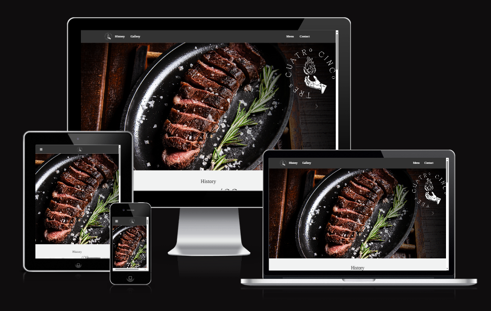

# Tres Cuatro Cinco Steakhouse

Tres Cuatro Cinco Steakhouse is an actual restaurant-based in Bogotá, Colombia. The restaurant, being a steakhouse, specializes in meats, with its main differentiating feature being that all dishes are prepared on a grill that operates 100% with wood fire, which imparts a unique and distinctive flavor.
The purpose of the website is to showcase some of the dishes and the spaces available so that individuals interested in hosting events at the restaurant can learn more about the venue and provide their contact information to be reached.

---

Tres Cuatro Cinco Steakhouse website is live, to access it click <a href="https://8000-madlp345-projectportfol-wxb5viruc1k.ws.codeinstitute-ide.net/" target="_blank">here</a>.
## Table of Contents

1. [User Experience (UX)](#user-experience-ux)
    - [User Stories](#user-stories)
    - [Design](#design)
2. [Features](#features)
3. [Technologies Used](#technologies-used)
4. [Testing](#testing)
5. [Deployment](#deployment)
6. [Credits](#credits)
7. [Acknowledgments](#acknowledgments)

---

## User Experience (UX)

#### Site Purpose:
To serve as a valuable resource for individuals seeking information about the restaurant, its unique offerings, and its event-hosting capabilities.
#### Site Goal:
To provide users with essential information about the restaurant, including its menu, ambiance, and unique wood-fire cooking process. Additionally, the website offers a visually appealing gallery of dishes and spaces, along with convenient contact information and a user-friendly form for making reservations or inquiring about hosting events at the venue.
#### Audience:
The website targets food enthusiasts, event planners, and individuals or groups looking to enjoy premium grilled dishes or host special events in a unique and inviting setting.
Current User Goals:
•	Staying up to date with new menu items or special announcements from the restaurant.
#### New User Goals:
•	Gain a general understanding of the restaurant’s concept, cooking methods, and atmosphere.
•	Explore the menu and view the gallery of dishes and event spaces.
•	Contact the restaurant by submitting a form or using the contact details provided on the website.
•	Access the restaurant’s social media to stay informed about updates and promotions.

---

### Design

#### Color Scheme:

  

Colour Scheme
As the pages of the site have a background image, I wanted to keep the colour scheme used on the site quite small so as to not overwhelm users. Black, white, and shades of grey create a classic and modern aesthetic, ensuring readability and contrast.

In my CSS file, I have used variables to declare colours and then used these throughout the file. I was recently introduced to this method during a hackathon—it is a useful convention as it allows you to alter the colour throughout the website by changing it once in the variable.

I have used #FFFFFF & #000000 as the primary and secondary colours for the site's text.
I have used #333333 as the overlay over the site's background image.
I have used #F1F2F2 for subtle highlights and backgrounds.
This minimalist palette ensures a professional and cohesive design.

#### Typography:
- **Font Family**: Tinos (imported from Google Fonts)

#### Imagery:
All images on the website were sourced directly from the restaurant. 

---

## Features

### Existing Features
1. **Navigation Bar**:

    

    The website features a fixed and consistent navigation bar across all pages, including the landing form page. Users can access the menu at any time, even after submitting the form, allowing them to continue exploring the site. Additionally, the active page is highlighted in the navigation bar, making it easier for visitors to identify their current location and ensuring smooth navigation.

  

    Additionally, I created a simple hamburger menu dropdown for screen widths of 968px or less, acknowledging online forums, and tutorials in the credits section. This enhancement improves the website's accessibility on smaller devices and ensures seamless navigation.

2. **Home Page**:

    The homepage serves as an engaging introduction to the restaurant's offerings. It features a visually appealing layout with high-quality images of signature dishes, creating an inviting atmosphere for visitors.
    

    Upon scrolling, you will encounter the history section that provides a narrative about the origins and evolution of Tres Cuatro Cinco Steakhouse. Accompanied by evocative images, it offers visitors insight into the restaurant's background and culinary philosophy.
    

    The next section is the menu that is organized into categories including:
<ul>Appetizers</ul>

Mains
</ul>
Salads
</lu>
Sides
</lu>
Desserts
</lu>
Each item is presented with a detailed description and price, allowing patrons to peruse the diverse culinary offerings.
3. **Gallery**:
    - Interactive image gallery showcasing portfolio pieces.

4. **Contact Form**:
    - Simple and functional contact form for user inquiries.

### Future Features
- Integration of a blog section.
- Dark mode toggle.
- Adding a newsletter subscription feature.

---

## Technologies Used

### Languages:
- HTML
- CSS
- JavaScript

### Frameworks/Libraries:
- [Bootstrap 5](https://getbootstrap.com/): For responsive design.
- [Font Awesome](https://fontawesome.com/): For icons.

### Tools:
- [Git](https://git-scm.com/): Version control.
- [GitHub](https://github.com/): Repository hosting.
- [Google Fonts](https://fonts.google.com/): For typography.
- [Figma](https://www.figma.com/): For wireframing and prototyping.

---

## Testing

Describe the testing process, including manual testing of:
- Responsiveness on various devices and screen sizes.
- Navigation and functionality of all links.
- Accessibility (using tools like Lighthouse).

### Bugs Fixed
- **Issue**: Navbar links were misaligned on small screens.
    - **Fix**: Adjusted CSS padding and margins for smaller breakpoints.

### Known Bugs
- **Issue**: Hover effects not functioning on some older browsers.
    - **Fix**: To be implemented in a future update.

---

## Deployment

### Deployment Steps:
1. Developed locally using [Visual Studio Code](https://code.visualstudio.com/).
2. Version-controlled via Git and pushed to [GitHub](https://github.com/madlp345/Project-Portfolio-1).
3. Deployed using GitHub Pages:
    - Go to the repository's **Settings**.
    - Under **Pages**, select the branch to deploy.
    - Click **Save** and your project will be live.

### Live Link:
[Project Portfolio 1 on GitHub Pages](https://madlp345.github.io/Project-Portfolio-1/)

---

## Credits

### Content:
- Text content created by [Your Name].

### Media:
- Images sourced from [Unsplash](https://unsplash.com/) and [Pexels](https://www.pexels.com/).

### Acknowledgments:
- Code Institute for the project template and guidance.
- Online communities like Stack Overflow and MDN Web Docs.

---

## Acknowledgments

Special thanks to my mentor, instructors, and peers at Code Institute for their invaluable support throughout the project.

